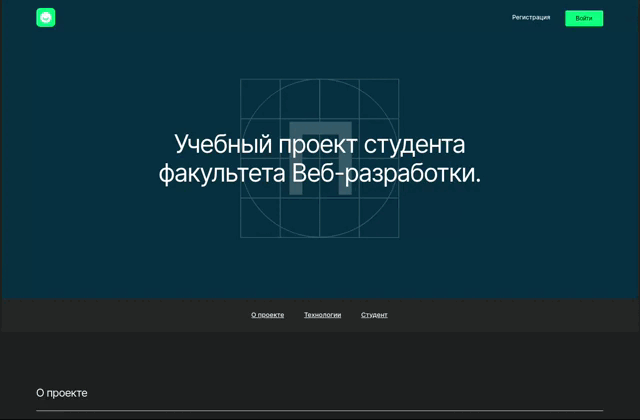
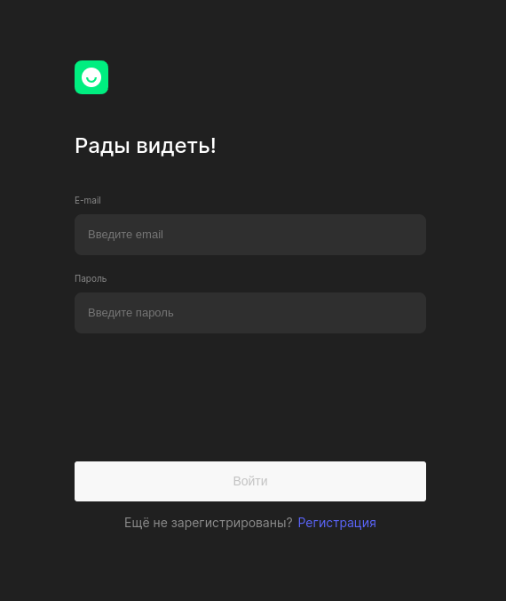
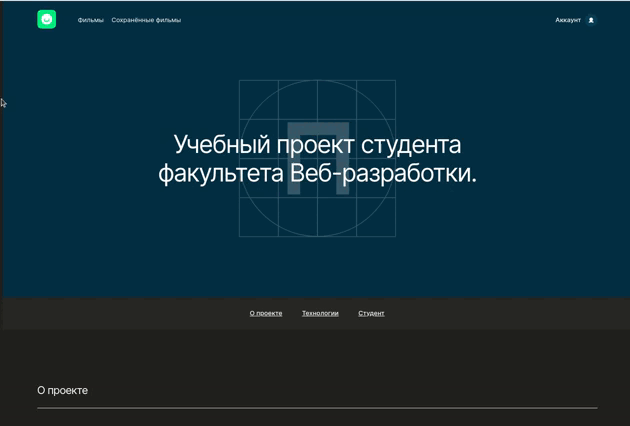

<h1 align="center">MoviesExplorer</h1>

  

<h2 align="center">
  <a href="https://yp23.movie.frontend.nomoredomainsicu.ru/" style="color: black;" target="_blank">🎬Ссылка🎬</a>
</h2>

<h2>Описание проекта</h2>

  MoviesExplorer - учебный проект, задачей которого было создание сервиса, позволяющего находить фильмы по запросу и сохранять их в личном кабинете.

  Главная страница содержит информацию о проекте и о студенте, выполнившем его.

  

  Реализована регистрация, авторизация, а также возможность редактировать профиль позьзователя. 

  
  
  

  На странице с фильмами есть форма поиска с фильтром по короткометражкам. Любой фильм можно сохранить в личном кабинете,  нажав на кнопку лайка.

  На странице сохраненных фильмов также доступна форма поиска с чекбоксом короткометражек.

  

- Страницы с фильмами защищены авторизацией
- Все формы валидируются
